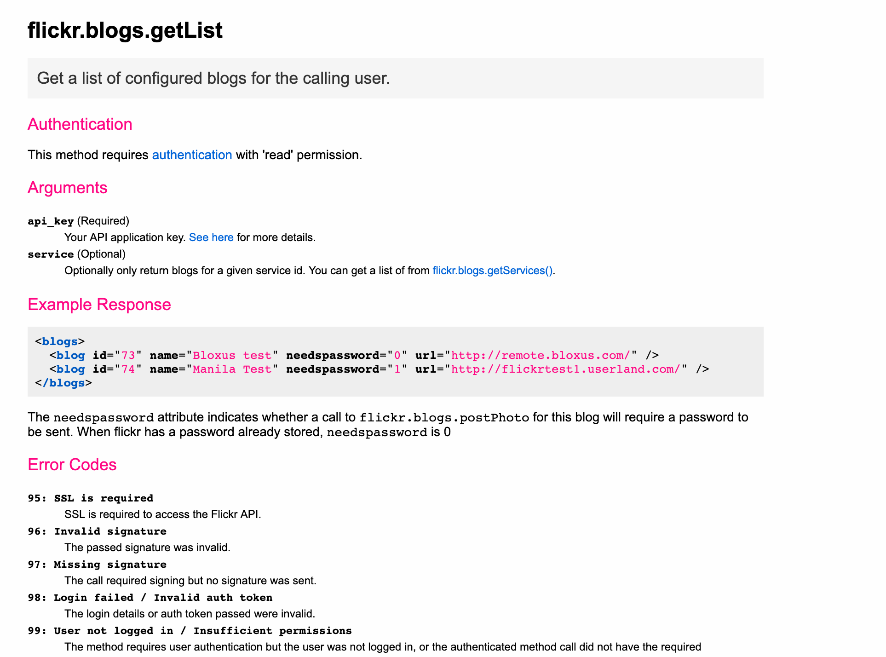

# Errors

> Format of the **error** payload

```js
{
	"error": {
		"type": "misdirected_request",
		"message": "Wrong region",
		"data": { // optional
			"region": "dal"
		}
	}
}
```

#### Possible errors

| Type                    | Default Message              | Notes                                                     |
| ----------------------- | ---------------------------- | --------------------------------------------------------- |
| `internal`              | Internal server error        |                                                           |
| `validation`            | Wrong format of request      |                                                           |
| `authorization`         | Authorization error          | Agent is not allowed to perform action                    |
| `authentication`        | Authentication error         | Invalid / expired access token                            |
| `request_timeout`       | Request timed out            | Timeout threshold is 15 seconds                           |
| `license_expired`       | License expired              |                                                           |
| `unsupported_version`   | Unsupported version          | Unsupported version of protocol                           |
| `misdirected_request`   | Wrong region                 | Client's request should be performed to another region    |
| `entity_too_large`      | Upload limit exceeded (10MB) | Client's request is too large                             |
| `wrong_product_version` | Wrong product version        | License is not LiveChat 3 (probably still LiveChat 2)     |
| `license_not_found`     | License not found            | License with specified ID doesn't exist                   |
| `requester_offline`     | Requester offline            | Method is only allowed for logged in agents (via RTM API) |


\* `misdirected_request` error returns also correct `region` in optional `data` object.
With this information client is able to figure out where he should be connected.




1. Wszystkie errory zebrane w jednej sekcji czy poszczegolne errory w widoku metod?
2. Wspomnienie o typowych errorach w widoku metody i link do glownego rozdzialu.

